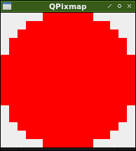

[en](./README.md)

# PySide2.QPixmap

　PySide2で画像を拡大表示する。

# デモ



# 開発環境

* <time datetime="2020-04-30T13:26:34+0900">2020-04-30</time>
* [Raspbierry Pi](https://ja.wikipedia.org/wiki/Raspberry_Pi) 4 Model B Rev 1.2
* [Raspbian](https://ja.wikipedia.org/wiki/Raspbian) buster 10.0 2019-09-26 <small>[setup](http://ytyaru.hatenablog.com/entry/2019/12/25/222222)</small>
* bash 5.0.3(1)-release
* Python 3.7.3
* Qt 5.11
* PySide

```sh
$ uname -a
Linux raspberrypi 4.19.97-v7l+ #1294 SMP Thu Jan 30 13:21:14 GMT 2020 armv7l GNU/Linux
```

# 使い方

```sh
git clone https://github.com/ytyaru/Python.PySide2.QPixmap.20200430132645
cd Python.PySide2.QPixmap.20200430132645/src
./install.sh
./run.sh
```

# 著者

　ytyaru

* [](https://github.com/ytyaru "github")
* [](http://ytyaru.hatenablog.com/ytyaru "hatena")
* [](https://mstdn.jp/web/accounts/233143 "mastdon")

# ライセンス

　このソフトウェアはCC0ライセンスである。

[](http://creativecommons.org/publicdomain/zero/1.0/deed.ja)

